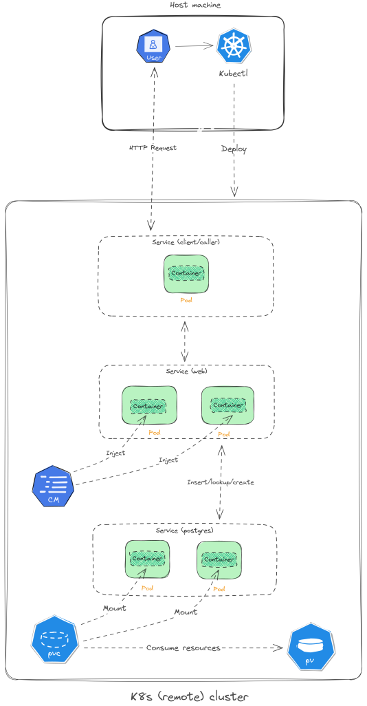

## Analysing s3 persisted dill files
A web application (based on FastAPI) running on Kubernetes that receives
requests for a specific month and day in 2024, gathers dill files 
belonging to the requested time from a S3 bucket, converts them into
a pandas dataframe, and counts the number of rows whose `failed_attrs != "empty"`.
If there are not any dill files for the requsted time, it returns a proper messsage
to the user. 

### Usage
| **File/Dir** | **Desc** |
| --- | --- |
| `k8smicro` | Directory containing the application source files. </br> `k8smicro/web` contains the source file for the web application and `k8smicro/caller` contains </br> the source file for the client that sends (when requested by the user) http requests to the web application |
| `Dockerfile` | Instructions to create the docker image of the web application and the client |
| `build-image.sh` | Facilitates building the docker images for the web application and the client </br> (both running in the k8s cluster). A build argument (`ARG role` in the `Dockerfile`) is used </br> to distinguish between the two components while building the images |
| `deploy.sh` | Facilitates deploying/removing the services into/from the K8s cluster (use `apply` or `delete` as its argument) |
| `deploy_app.yaml` | A manifest file to deploy the web application into the cluster |
| `deploy_postgres.yaml` | A manifest file to deploy Postgres into the cluster |

To start the service, run the following in the command line
```bash
./deploy.sh apply
```
You should see the following output
```bash
configmap/postgres-secret created
persistentvolume/postgres-volume created
persistentvolumeclaim/postgres-volume-claim created
deployment.apps/postgres created
service/postgres created
deployment.apps/web-deployment created
deployment.apps/caller-deployment created
service/web-service created
service/caller-service created
```

You then need to map port 8000 of `caller-service` (see `kube-deploy.yaml`) to the port 8000 of the localhost. 

```bash
kubectl --kubeconfig /path/to/kubeconfig.yaml port-forward svc/caller-serv
ice 8000:8000
```

You can now start sending your http requests to the designated endpoints (via [Postman](https://www.postman.com/), for example).

When you are done, run the following in the command line to remove the deployments and services from the k8s cluster

```bash
./deploy.sh delete
```

### Service Component Graph

<p align="center"></p>